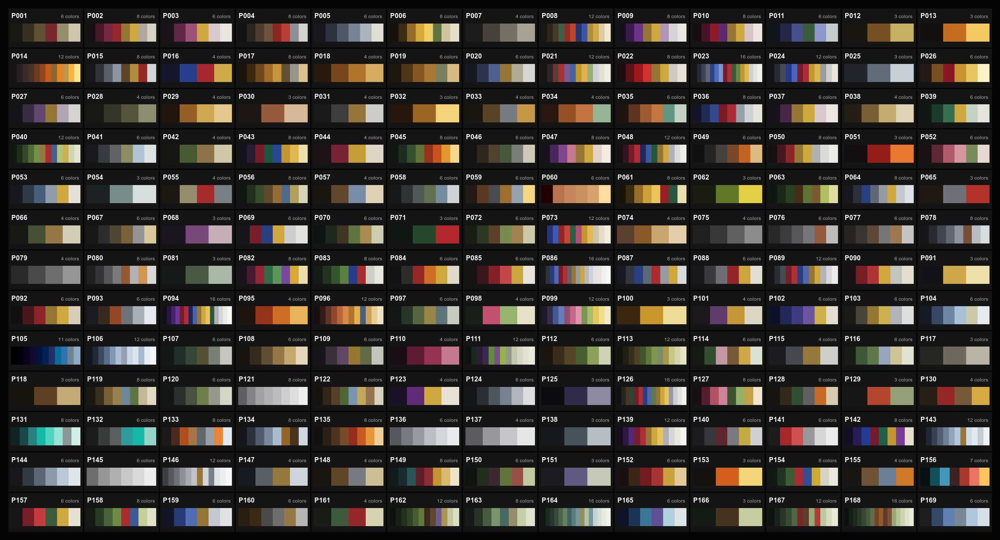
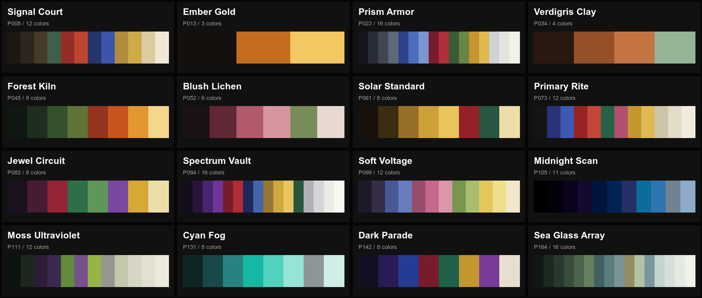

# 0.9.10 Phase-Zero Performance Baseline

Date: 2026-08-28

This report records the local baseline used to choose the 0.9.11 density and
glyph-atlas budgets. It is evidence from one development machine, not reference-
floor certification.

## Test Contract

- Source: the tagged 0.9.10 release with benchmark-only instrumentation.
- Build: optimized Tauri application bundle.
- Fixture: bundled 1920x1080 H.264, 24 FPS, 30-second video.
- Workload: main preview at a 30 FPS cap, deterministic synthetic audio-reactive
  updates, native Pop Out on the only connected display, and a transition phase.
- Machine: MacBookPro18,2, Apple M1 Max, 64 GB, arm64, macOS 26.6.2.
- Samples: 9 to 12 seconds per density after launch, with P95/P99 frame-window
  timing and process RSS sampling.

The release reference floor remains Apple M1 with 16 GB. This M1 Max result can
compare 0.9.10 and 0.9.11 on the same host, but it cannot certify the reference
floor. The native Pop Out occupied the connected display work area, which was
larger than the 1080p acceptance target.

The JSON reports in this directory are the machine-readable source of truth.
Some runs have a non-zero smoke exit even when the recorded renderer phase met
30 FPS because the pre-existing smoke gate also checks unrelated average and
native reactive-rate thresholds. Density decisions below use the reported
per-phase FPS and P95/P99 values, not the wrapper exit alone.

## Accelerated Results

The auto backend selected WebGPU.

| Columns | Main FPS | Pop Out phase FPS | Pop Out P95 | Peak RSS |
| ---: | ---: | ---: | ---: | ---: |
| 480 | 30.1 | 30.1 | 35.86 ms | 433.3 MB |
| 600 | 29.9 | 29.9 | 35.86 ms | 438.0 MB |
| 640 | 30.1 | 30.2 | 35.71 ms | 434.7 MB |
| 720 | 29.9 | 30.1 | 35.75 ms | 438.2 MB |
| 900 | 30.2 | 30.0 | 35.75 ms | 488.8 MB |

WebGL2 also held approximately 30 FPS at 640 columns. A 720-column run showed a
24 FPS minimum and 38.47 ms P95 during Pop Out, so 640 is the conservative
normal accelerated ceiling. The 900-column WebGPU run met the cap on this host
but consumed about 50 MB more peak RSS and is not evidence for the M1/16 GB
floor.

Decision: normal accelerated rendering is limited to 640 requested columns.
The global Advanced Density preference may expose values through 900 with an
explicit performance warning and without a 30 FPS guarantee.

## Software-Fallback Results

Canvas2D held the main/Pop Out 30 FPS cap at 120 columns. Its transition phase
fell to 28.1 FPS at 140, 26.9 FPS at 150, and 25 FPS at 160. At 240 columns it
fell to roughly 16 FPS, and at 480 it fell to roughly 5 FPS.

The pixel-canvas path held 30 FPS at 120 and 160 columns, then fell to 23.1 FPS
in the main phase and 21.1 FPS with Pop Out at 240. At 480 it reached only 8.8
FPS in the main phase and 7.0 FPS with Pop Out.

Decision: both software fallbacks share a conservative 120-column normal
ceiling. This keeps the policy simple and protects the slower Canvas2D path.
Advanced Density can still expose the full requested range for diagnostics or
deliberate lower-frame-rate work.

## Unicode Atlas Budget

The approved common multilingual blocks contain 32,784 scalar values:

| Coverage | Scalars |
| --- | ---: |
| CJK Unified Ideographs U+4E00-U+9FFF | 20,992 |
| Hangul syllables | 11,184 |
| Hiragana | 96 |
| Katakana | 96 |
| CJK symbols and punctuation | 64 |
| CJK radicals | 352 |

At 16x16 one-channel glyphs the raw alpha payload is about 8.0 MiB. With an
18x18 padded tile it is about 10.1 MiB, or three 2048x2048 one-channel pages
(12 MiB allocated). Runtime cell cost depends on the active ramp, which remains
bounded to 96 glyph ids; the full catalog affects package, load, and cache
memory instead of per-cell search complexity.

Decision: use build-time pages and integer glyph ids, load multilingual pages
on demand, and cap the active ramp at 96 scalars. Atlas metadata must retain a
style id so later releases can add styles without changing renderer contracts.

## Palette Review

The local reference archive contained 169 valid palette records. It was used as
design input only: the archive, schema, filenames, and source names are not
shipped. The full review sheet uses neutral candidate ids.



The selected 16 provide three through sixteen colors, restrained and saturated
options, warm and cool families, and several useful luminance distributions.



The project-native names are Signal Court, Ember Gold, Prism Armor, Verdigris
Clay, Forest Kiln, Blush Lichen, Solar Standard, Primary Rite, Jewel Circuit,
Spectrum Vault, Soft Voltage, Midnight Scan, Moss Ultraviolet, Cyan Fog, Dark
Parade, and Sea Glass Array.

## Reproduction

Build the optimized development app, then run:

```sh
npm run bench:density
```

Override `ASCILINE_DENSITY_BENCH_COLUMNS`,
`ASCILINE_UI_PERF_SMOKE_BACKEND`, and
`ASCILINE_DENSITY_BENCH_REPORT_PATH` to reproduce a specific sweep and retain
its JSON report.
