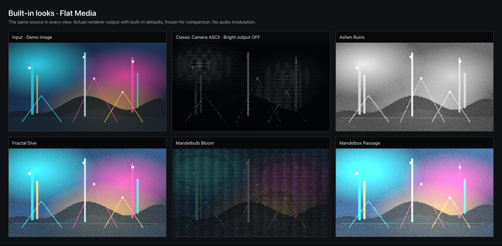
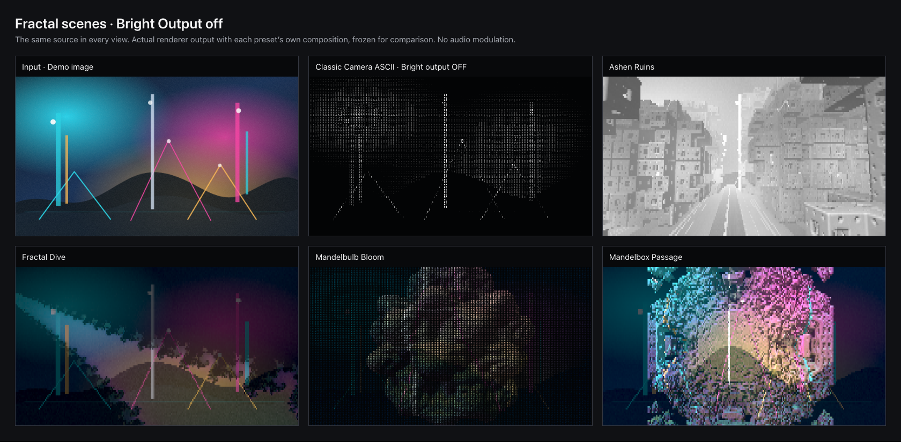
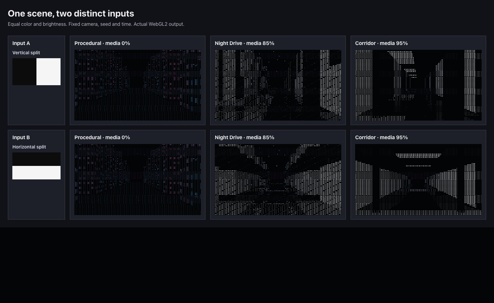
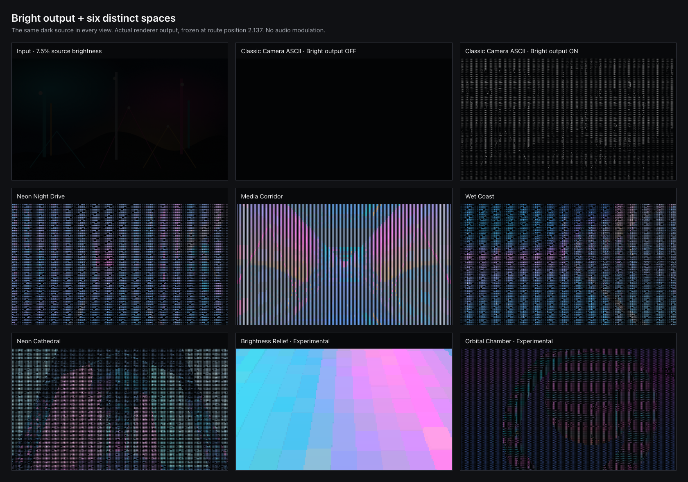

# 1.1.0 — Spatial ASCII

Date: 2026-09-29. Status: **owner approved for publication; release gates in progress**.
Source branch: `release/1.1.0`, based on `caefa8ec9708ff782af9a6a1a4b7946a8953046c`.
Version 1.1.0 is synchronized across npm and Tauri.

## Release decision — 2026-09-29

The first release PR CI run caught a Windows CRLF checkout failure in native
spatial shader extraction. The loader now shares a line-ending-independent
module extractor with the cell-color shader, with LF/CRLF regression coverage.
Publication requires the corrected source to pass the full platform matrix.

The owner explicitly approved documentation updates, merging to main, deployment
and cleanup. This supersedes the earlier manual-testing hold recorded below.
It authorizes the established signed desktop release and updater publication
workflow; it does not turn unrecorded manual or physical checks into passes.

The final implementation is `38beda3`. The release will use the exact main-push
commit accepted by Desktop CI, immutable `v1.1.0` artifacts, and the existing
macOS/Windows/Linux installed-artifact and updater-hop checks. Public macOS
packages require Developer ID signing and notarization; Windows installers
retain their documented unsigned-preview status.

Remaining physical coverage includes M1/16 GB reference-floor performance,
macOS 13 runtime, representative Windows/Linux camera/audio/GPU behavior,
external-projector alignment, physical MIDI and sound-to-display latency.
These follow-ups remain tracked in [Testing](../TESTING.md#hardware-and-platform-checks)
and the [Roadmap](../ROADMAP.md#distribution-and-platform-validation).
Earlier pending rows and local test limitations are historical evidence.

## Scope

The candidate adds eleven source-preserving looks: Neon Night Drive, Media
Corridor, Wet Coast, Neon Cathedral, Orbital Chamber, Ashen Ruins, Fractal Dive,
Mandelbulb Bloom, Mandelbox Passage, Edge Etching and Phosphor Echo. Brightness
Relief has been removed from the built-in preset catalog; its mode remains
compatible with existing saved looks. Orbital Chamber no longer carries an
Experimental label. The preset contract is 90 total: 62 accelerated and 28
explicit Canvas.

| Recommendation | Implemented behavior |
| --- | --- |
| Architectural raycasting | Bounded grid traversal, variable building heights, tall-behind-short visibility, roofs, perspective-correct camera-plane rays, floors and ceilings |
| Media on surfaces | One selected image/video/camera texture, repeat/fit/crop framing and procedural/media blend |
| Camera choreography | Forward, street weave and travelling look-around routes, signed speed, freeze, reset and shared preview/native transport |
| Materials and atmosphere | Seeded windows, surface glyphs, directional light, contact darkening, distance fog and analytic emission |
| Wet scenes and weather | A bounded reflected ray for wet floors, animated ripples and four rain sheets clipped against scene depth |
| Edge-directed ASCII | Horizontal/vertical/diagonal glyphs with threshold hysteresis on flat media |
| Feedback | Two reusable float history buffers, elapsed-time decay, zoom/rotation, explicit reset and invalidation on scene/source/layout changes |
| Relief and raymarching experiments | Brightness-driven block heights and a bounded sphere/ring scene; no inferred real-world depth |

All scene code is original. TheProgramOne/3D_Ascii_CIty at
`1612541dc04f89fb8078edc7406838b3e9d3d236` served as a visual reference;
no upstream source, assets, fonts or sound were imported.

The implementation extends existing media, color/palette, glyph, transition,
audio, MIDI and native-output paths. A small shared contract owns controls and
bounds. WebGPU and native wgpu share the scene WGSL; WebGL2 uses a bounded
syntax conversion tested through real shader execution. Canvas supplies the
software reference under its existing density limits. Runtime remains offline.

## Flat Media defaults and WTF follow-up (2026-09-29)

All 90 built-in presets now select **Flat Media**, including Ashen Ruins.
The scene-named presets remain in the catalog with their color/glyph treatments
and stored camera settings. Select the related Visual mode in Space / Motion
to enable geometry; reselecting a built-in returns to Flat Media. Saved custom
looks and existing persisted choices retain their selected mode. Bright Output
remains off by default and stays user-owned.

WTF draws its visual mode once per transition: 80% Flat Media, with the other
20% shared evenly among the ten non-flat modes (2% each). The selected mode
survives preset anchors, all visual-safety retries and the final fallback.
Spatial choices load their scene's camera settings, unfreeze travel and use
Auto with existing renderer fallback. This avoids carrying an unsuitable
camera view from a previous look. Color and glyph choices remain randomized.

Validation covers exact random-choice boundaries, every spatial bucket,
44 integrated retry/fallback cases, 216 live scene-control checks, saved
spatial look transitions interrupted by manual/MIDI edits, and source/video
continuity. Geometry and shaders are unchanged; their CPU/GPU parity and
moving-source response checks still run with manually enabled scene recipes.
The complete browser preset matrix and offline bundle check passed. The
optimized, locally installed macOS development app passed **90/90 presets**,
including **90/90 Flat Media defaults** in app, renderer and native-output
params, with the unchanged **62 WebGPU / 28 Canvas** ownership split and no
failures. The gallery below is a fresh WebGL2 capture of the new defaults.



## Audio response and WTF weighting follow-up (2026-09-29)

WTF now chooses Flat Media with 80% probability and each of the ten remaining
modes with 2% probability. The existing safety retry/fallback tests retain the
chosen mode; all built-in presets continue to start in Flat Media.

Audio feature reads and reactive synchronization now target 120 Hz. Native input
requests 128-frame buffers within the supported device range, with the existing
default buffer as fallback. Browser and native feature delivery share immediate
attacks and elapsed-time release; Smoothing zero bypasses this envelope. Beat
decay and history remain consistent when the buffer size or polling rate changes.
Steady Pop Out updates no longer apply audio modulation twice; autonomous native
transitions retain direct audio response on their unmodulated endpoints.

The optimized macOS probe used 640 columns, bundled 1080p video, native microphone
input and visible Pop Out. Its [bounded timing report](evidence/1.1.0-audio-latency.json)
recorded 2.67 ms capture windows, 1 ms median / 6 ms p95 feature-read IPC and
2.81 ms median / 6.94 ms p95 feature-age bounds at delivery across 30 samples.
These exclude physical hardware and display delay. Preview averaged 38.4 FPS
alone, 39.3 FPS with Pop Out and 35.3 FPS during transitions; worst phase p95 was
30.67 ms. Native Pop Out averaged 59.9 FPS, with zero GPU failures or presentation
backlog. All eight native transitions passed.

Audio regression checks cover smoothing, native reply races and parameter
ownership; Rust passed 84/84 tests. The spatial GPU/source/control/WTF suite and
static UI suite passed. Offline bundle, media-source policy and renderer resource
checks passed. The first timing report exposed diagnostic truncation; per-phase
and audio summaries now fit the existing diagnostic bounds. A separate obscured
window run failed presentation validation and captured WebKit external-video
`GPUDevice.createBindGroup` errors; the final visible foreground run passed the
unchanged gates without new reports. Those local diagnostics are preserved;
background/occlusion recovery still needs manual review. Reproduction is in
[Testing](../TESTING.md#audio-response).
Physical listening, system-audio timing and other-platform hardware acceptance
remained manual at this checkpoint. Publication was held at that time.

## Video-frame and audio-control recovery (2026-09-29)

The six local `GPUDevice.createBindGroup` reports map to the per-frame video
external-texture binding. The WebGPU path now holds an explicit decoded
`VideoFrame` until queue submission, then closes it even on failure. This
avoids WebKit's cached HTML-video texture lifetime. Decoder import retries are
retained, failed frames no longer advance feedback/history counters, and an
exception cannot permanently break the animation-frame loop.

Audio Stop invalidates unfinished capture startup and releases late browser
streams. Native start/stop commands run in order, and cancelled errors cannot
disable a newer session. Selecting an audio preset restores all audio sliders;
custom tuning is labeled in the selector, so reselecting the same preset works.
UI and MIDI share this behavior without restarting capture or changing media.
Audio changes also interrupt autonomous native modulation during a transition,
including when its acknowledgement arrives after Stop.

Regression checks cover delayed browser capture, context resume and file play;
native input/display Stop/Start ordering; current versus stale failures; preset
reset; and edits during native transition arming. The full static UI suite
passes, including Custom labeling/reselection and capture continuity. Renderer
resource/lifetime, fallback, MIDI, spatial CPU/GPU/source/control/WTF, media
policy and offline bundle checks pass. The optimized Dev app builds locally.

Two initially obscured native performance runs failed the unchanged throughput
gates, but produced no new frontend reports. Revealing
the app restored rendering. An exploratory Chromium external-video seek fixture
failed to import both explicit VideoFrame and original HTML-video textures;
this driver limitation is not claimed as a passing video test. An exploratory
WebKit seek fixture timed out, so seek behavior is not claimed as verified.
The retained native performance probe exercises playing video and now fails
on new frontend errors. The six historical local reports remain preserved.

The final [native video/audio recovery probe](evidence/1.1.0-control-recovery.json)
passed at 640 columns with all windows visible: preview averaged 38.8 FPS alone,
38.2 FPS with Pop Out and 34.5 FPS during eight native transitions. Pop Out
presented at 60.0 FPS with zero GPU failures or presentation backlog. There were
zero frontend errors, failed state updates or failed transition arms. Native
audio retained 2.67 ms capture windows, 1 ms median / 3 ms p95 IPC, and 5.54 ms
p95 feature-age bounds at delivery. These are software timing observations,
not physical sound-to-display latency.

Installed-app UI verification confirmed Stop changes to Start/Idle and clears
all meters, Start reconnects the microphone, slider edits show Custom, and
Dense Mix Control restores Sensitivity 9.00 / Density Dampening 0.70. The app
was returned to Demo Image / Ashen Ruins / Flat Media / Bright Output off with
Pulse Reactor selected. Background window throttling remains an OS behavior;
the visible performance run above is the throughput acceptance result.

Publication was held for owner testing at this checkpoint; see the later release decision above.

## Fractal follow-up (before Flat Media defaults)

Bright Output now starts **off**. An existing saved choice is retained, and
presets never overwrite this global preference. All four new scenes work with
it off and keep the selected input, live controls, transport and native output.

- **Ashen Ruins** takes its pale atmosphere and carved architecture from
  [Remnants by Alcatraz](https://www.pouet.net/prod.php?which=96536).
- **Fractal Dive**, **Mandelbulb Bloom** and **Mandelbox Passage** are inspired by
  the animated Mandelbrot, bulb and box views on [Wasting My Time](https://wastingmytime.net/),
  also described in the [linked article](https://boingboing.net/2026/09/28/full-screen-animated-mandelbrot-fractals-on-the-web.html).

These are original scene implementations of standard fractal mathematics;
reference source code, artwork, audio and runtime assets were not imported.
Zoom, detail and shape use the existing canonical parameter contract and the
last three slots in the unchanged 160-byte spatial uniform block. The three
3D modes reuse one bounded marcher and source/shading path. Mandelbrot zoom
is bounded for float32 stability; it is not an arbitrary-precision explorer.
Ashen Ruins, Fractal Dive and Mandelbox Passage use solid cells to reveal their
structure. Glyph controls remain available. Mandelbulb Bloom uses Braille.



## Earlier source visibility correction

Manual feedback identified that the first candidate's city/coast/cathedral
looks defaulted to procedural materials, while material glyphs could conceal
source structure even after increasing the blend. The revised candidate uses
85–100% media in all spatial presets, larger wall panels with aspect-aware
framing, media on roofs/ceilings, and a media backdrop for Orbital Chamber.
Material-glyph coverage fades as media contribution rises, leaving source
brightness to select glyphs. Media amount zero retains the procedural option.
Existing saved/custom values are preserved; reselect a spatial preset to load
its revised defaults.

A new regression compares equal-histogram vertical/horizontal source patterns
at the same seed, camera and time. With Bright output enabled, all six scene
presets change 22–60% of output cells by more than 24/255 in at least one RGB
channel, and 20–60% in glyph address. Both WebGPU and WebGL2 pass the actual moving-source upload/readback
check. This measures input sensitivity; it does not substitute for judging
recognizable camera/video content by eye.



## Earlier brightness and composition review

This earlier review used Bright Output on by default; the current default is
off as described above. The global **Color → Bright output** toggle persists across
launches and remains unchanged by presets, playlists and WTF. It lifts
luminance before glyph selection, with hue-preserving gamut compression.
Source colors are lifted before contrast; palettes retain their lookup and
cycling ranges, then lift the mapped result with stable base glyph luminance.
Dark neutral RGB 16 becomes 139 at neutral color settings;
pure black/white keep their endpoints. Off retains the previous response.
No histogram readback, exposure pumping, extra GPU pass or source restart is
introduced. CPU spatial sampling retains floating-point color until the final
cell conversion so the lift does not magnify early rounding errors.

The six scene presets now have distinct heights, lens angles, speeds and glyph
styles. City drives low and fast; Corridor is narrow and symmetric; Coast has
low shoreline buildings and open water; Cathedral looks upward through a
pitched nave; Relief looks down on solid-cell source-driven terrain without
roads; Orbitals circles a sphere and a tilted rotating ring. Camera tilt is an
editable shared parameter. Reselect a preset to load the revised composition.

The visual review below uses the same bundled demo image reduced to 7.5%
brightness in every panel. Classic Camera ASCII's mean displayed luminance
rises from 3.86 to 18.36 with the toggle (about 4.8×, including black gaps).
This is one recorded fixture, not a universal exposure guarantee. On a separate
common dark pattern, every pair of spatial presets changes at least 72% of
cells by more than 24/255 in RGB at the same grid and time, before glyph style
and density differences. This measures composition difference, not aesthetic
acceptance.



## Deliberate limits

- Traversal is currently per **cell**, capped at 64 steps and 40 world units;
  it is not per final display pixel. A per-column visibility cache from the
  research proposal remains a measured optimization opportunity. This candidate
  uses the simpler common shader to preserve roofs and variable-height
  visibility across backends; it does not claim that optimization is complete.
- Architectural worlds are bounded, periodic 2.5D compositions; fractal scenes
  use bounded mathematical surfaces. There are no bridges,
  overlapping rooms, free flight, world editor or per-surface media files.
- The light/contact/glow terms are artistic approximations. Rain uses sheets,
  not a particle simulation. The map is generated analytically from its seed.
- The existing beat feature drives restrained accents, without a new BPM/bar
  synchronization contract. MIDI still cannot select sources or control Pop Out.
- Native accelerated output renders its own scene. Explicit Canvas scenes use
  the existing mirror path. A missing native GPU does not silently render flat
  media in place of the scene; Canvas is the documented fallback.
- Older WebGL2 devices without float render attachments use byte history with
  an extra decay correction. This prevents stuck trails but changes their fade.

## Fractal follow-up validation

The desktop/offline/static `npm test` suite passed, including the 90-preset
browser matrix and the synthetic Jev check. Following the final Mandelbulb
optimization, the focused spatial checks, Rust suite (**81/81**), shared shader
validation and optimized native WebView sweep were repeated successfully:
**90/90**, with **62 WebGPU / 28 Canvas**, no ownership fallbacks or failures.

The real WebGPU/WebGL2 readback test now covers flat media plus ten scene modes
(including saved relief compatibility), with 26 geometry/brightness/feedback
cases. Maximum mean RGB error was 1.29/255; the existing 2/255 mean and 2% channel-error
thresholds were retained. All four new presets change roughly 45–51% of cells
when equal-histogram source shapes change. The test also covers 216 live control
edits, edits during preset/MIDI transitions, both saved brightness preferences,
native payload propagation and uninterrupted video playback. Parameter-limit
fixtures cover finite fractal output and effective zoom/detail/shape controls.
On one common dark source, every pair of current spatial presets differs in
at least 42% of cells before glyph style and density differences.

An initial 240-column Mandelbulb run missed the native source-feed budget
(18 FPS for a 24 FPS clip). The final implementation intersects a containing
sphere before marching and reuses radial-power evaluation. The repeat passed
without changing density, iteration limits or performance gates. Centered
surface normals and smooth boundary color also resolved CPU/GPU shading
mismatches and reduced numerical sparkle.

Both native runs used the bundled 30-second video, synthetic audio and one
physical display on Apple M1 Max / 64 GB:

| Workload | Preview average / P95 | Native presentation | Native source feed |
| --- | --- | --- | --- |
| Existing city, 640 columns, Bright Output on, wet reflections/rain | 38.3 FPS / 31.53 ms | 60.0 FPS | 23.8 FPS |
| Mandelbulb, 240 columns, Bright Output off, detail 5 | 39.1 FPS / 28.75 ms | 57.8 FPS | 23.6 FPS |

Both passed with zero GPU or native-transition failures. These are measured
local workloads, not a guarantee for maximum fractal detail/density, reference-floor
hardware or other platforms. The installed Dev app was reopened; Ashen Ruins,
its three fractal controls, Bright Output off, the 90-preset catalog and the
unqualified Orbital Chamber label were observed in the native UI. Owner review
of camera/video, external-display alignment and physical audio/MIDI remains
pending. No publication or deployment was performed.

## Earlier local validation (before fractal follow-up)

A follow-up interaction check reproduced a manual-control race: changing Field
of view during a numeric preset transition was overwritten by the next tween
frame. Direct visual controls and MIDI now interrupt the transition and retain
the edited Custom look. An interrupted crossfade retains its incoming renderer
and cleans up the outgoing layer. The spatial smoke checks 21 controls across
all six scenes, edits during numeric transitions and crossfades, MIDI edits,
persistence, native output parameters and uninterrupted video playback.
The follow-up browser preset suite passed and the optimized Dev app was rebuilt
and installed. The new interaction assertions run in Chromium; native slider
gesture timing remains an owner manual check rather than a claimed pass.

The `npm test` desktop/static stages passed, including desktop/offline checks,
the 87-preset browser matrix and source/transition/palette checks. The hosted
Jev call then returned an incomplete-response error; the bounded
`npm run test:jev` retry passed. Jev received only the maintained synthetic
fixtures, not user media, and is not a visual or hardware acceptance result.
The native Rust suite was rerun after adding the palette regression (81/81).

The optimized macOS development bundle also passed the native WebView
preset sweep: **87/87**, with 59 WebGPU and 28 Canvas presets, no ownership
fallbacks and no failures. Rust/shader, GPU source-response, browser preset and
native performance checks were repeated after the source-visibility correction.
The brightness revision also checks all palette swatches with the toggle on
and off, cycling animation, stable palette glyph luminance and live preference
propagation. The static harness now tests glyph gaps without downsampling and
starts its playback-continuity check away from the 2.5-second demo's loop boundary.
The optimized build passed the 87/87 native sweep again after this revision.
Native trail appearance and preview/Pop Out alignment remain on the owner
manual checklist.

Additional spatial checks exercise DDA corner/axis/empty rays, roofs and
occlusion, camera projection, periodic seams, signed/frozen transport, shared
JS/Rust uniform vectors, bounded audio and floating-point trail decay.
The GPU smoke compares flat plus all six scenes against CPU cell colors on
both WebGPU and WebGL2. It also checks frozen frames, long dim trails, Canvas
density limits, visual MIDI targets, and uninterrupted real-video playback
through the eight new looks and back to Classic Camera ASCII.

Installed Chromium intermittently returned an invalid startup swapchain with
both the baseline WebGPU renderer and this candidate. The numerical harness
therefore starts its app fixture on WebGL2 and explicitly tests WebGPU on an
offscreen attachment; GPU diagnostics still fail the check. This is not a
claim that Chromium's startup warning has been fixed. The native WebView sweep
and native output measurements cover the actual desktop presentation paths.

The optimized native macOS city workload used the bundled 30-second video,
640 columns, Bright output on, 85% source media, wet reflections, rain and
synthetic audio on **Apple M1 Max, 64 GB**, with one physical display.
Existing gates were not relaxed:

| Observation | Result |
| --- | --- |
| Main preview before Pop Out | 39.2 FPS average, 27.80 ms P95 |
| Main preview with Pop Out | 38.6 FPS average, 27.80 ms P95 |
| Main preview during numeric transitions | 36.6 FPS average, 29.65 ms P95 |
| Native presentation, phased run | 60.1 FPS average; zero GPU failures |
| Armed native transitions | 10; zero failures |

The maintained performance smoke passed. The full phased run averaged
38.1 FPS in the preview, with 29.65 ms P95 and 29.65 ms P99. Its minimum sample
was 33.7 FPS, so this is not a guarantee of uninterrupted frame pacing.
These measurements are not acceptance on the M1/16 GB reference floor,
Windows/Linux hardware, a projector, physical cameras or a MIDI controller.

Reproduce with:

```sh
npm test
npm run smoke:spatial
npm run tauri:build:dev -- --bundles app
npm run smoke:primary-presets
ASCILINE_UI_PERF_SMOKE_SPATIAL='{"visualMode":"city","brightOutput":true,"sceneMedia":0.85,"sceneWet":0.55,"sceneRain":0.2}' ASCILINE_UI_PERF_SMOKE_COLUMNS=640 ASCILINE_UI_PERF_SMOKE_SYNTHETIC_AUDIO=1 ASCILINE_UI_PERF_SMOKE_DURATION_MS=18000 npm run smoke:ui-perf
```

Set `ASCILINE_UI_PERF_SMOKE_SOAK=1` for the separate steady workload. Full
procedures and the spatial checklist live in [Testing](../TESTING.md).

## Manual candidate

Local installation: `~/Applications/ASCII VJ Remix Dev.app`, version 1.1.0,
bundle ID `com.asciline.remix.dev`, signed with the existing stable local
development identity. Production installation and public updater are untouched.
Launch it normally, or run `npm run desktop:run-local` to reinstall the current
optimized development bundle through the maintained signing/launch harness.

The original owner-review checklist was:

- Bright output off/on on dark camera, image and video inputs; verify its saved
  preference and compare native Pop Out with the main preview.
- The eleven new presets on a selected video and camera, including close walls,
  height changes, reverse travel, pause/reset, and transitions back to old looks.
- Pop Out alignment, external-display fullscreen, reopen/resize and the chosen
  density; compare preview/output motion and source framing by eye.
- Physical audio and UC-33e/mioXC response, saved presets and playlist use.
- Low-light trail decay, material/edge glyph legibility, and fractal zoom/detail/shape
  edits after a preset transition on representative footage.

Public signing/notarization, Windows/Linux packages, updater installation and
physical reference-floor acceptance are distinct evidence stages. The release
decision above supersedes the original publication hold; pending physical checks
remain follow-up work.
